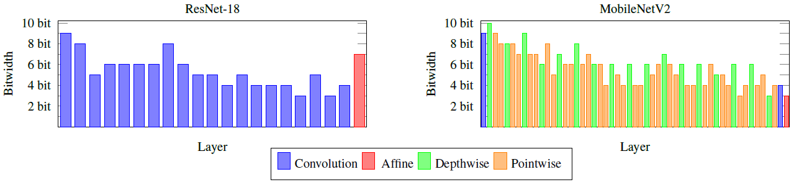
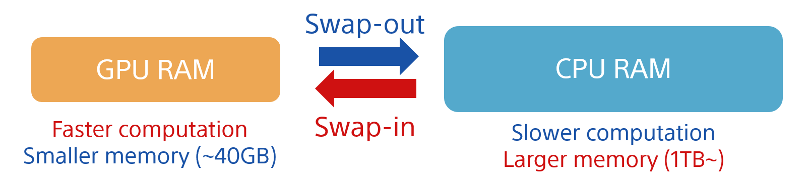
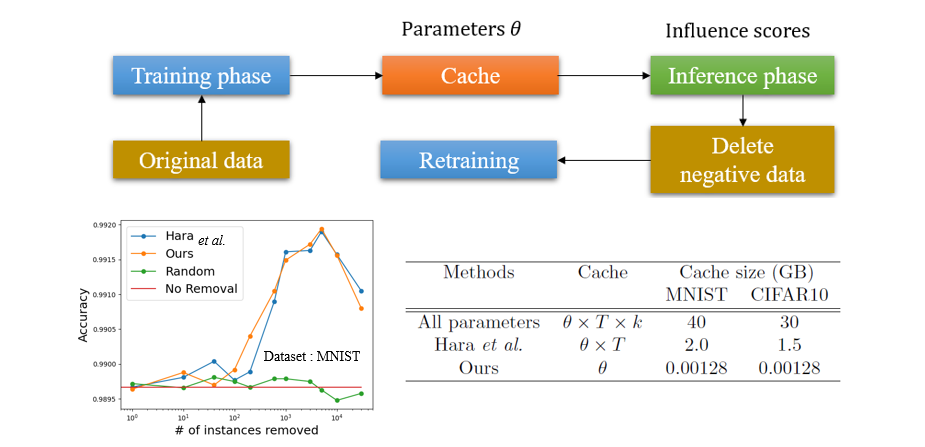

# Sony AI Research Code

This repository contains code related to research papers in the area of 
Machine Learning and Artificial Intelligence, that have been published by Sony. 
We believe in transparent and reproducible research and therefore want to offer 
a quick and easy access to our findings. Hopefully, others will benefit as much
from them as we did.

## Available Code

### [**Mixed Precision DNNs: All you need is a good parametrization**](https://openreview.net/forum?id=Hyx0slrFvH&noteId=Hyx0slrFvH&invitationId=ICLR.cc/2020/Conference/Paper2519) ([Code](./mixed-precision-dnns))
> Uhlich, Stefan and Mauch, Lukas and Cardinaux, Fabien and Yoshiyama, Kazuki and Garcia, Javier Alonso and Tiedemann, Stephen and Kemp, Thomas and Nakamura, Akira.
> Published at the 8th International Conference on Learning Representations (ICLR) 2020
> *arXiv technical report ([arXiv 1905.11452]( https://arxiv.org/abs/1905.11452))*

Efficient deep neural network (DNN) inference on mobile or embedded devices typically 
involves quantization of the network parameters and activations. 
In particular, mixed precision networks achieve better performance than networks 
with homogeneous bitwidth for the same size constraint. Since choosing the optimal 
bitwidths is not straight forward, training methods, which can learn them, 
are desirable. Differentiable quantization with straight-through gradients allows 
to learn the quantizer's parameters using gradient methods. We show that a suited 
parametrization of the quantizer is the key to achieve a stable training and a good 
final performance. Specifically, we propose to parametrize the quantizer with the 
step size and dynamic range. The bitwidth can then be inferred from them. 
Other parametrizations, which explicitly use the bitwidth, consistently perform worse. 
We confirm our findings with experiments on CIFAR-10 and ImageNet and we obtain mixed 
precision DNNs with learned quantization parameters, achieving state-of-the-art performance. 

### [**ALL FOR ONE AND ONE FOR ALL:IMPROVING MUSIC SEPARATION BY BRIDGING NETWORKS**](https://arxiv.org/abs/2010.04228) ([Code](./x-umx))
NNabla implementation of __CrossNet-Open-Unmix (X-UMX)__ is an improved version of [Open-Unmix (UMX)](https://github.com/sigsep/open-unmix-nnabla)  for music source separation. X-UMX achieves an improved performance without additional learnable parameters compared to the original UMX model. Details of X-UMX can be found in [our paper](https://arxiv.org/abs/2010.04228).

__Related Projects:__  x-umx | [open-unmix-nnabla](https://github.com/sigsep/open-unmix-nnabla) | [open-unmix-pytorch](https://github.com/sigsep/open-unmix-pytorch) | [musdb](https://github.com/sigsep/sigsep-mus-db) | [museval](https://github.com/sigsep/sigsep-mus-eval) | [norbert](https://github.com/sigsep/norbert)

## The Model

As shown in Figure (b), __X-UMX__ has almost the same architecture as the original UMX, 
but only differs by two additional average operations that link the instrument models together. 
Since these operations are not DNN layers, the number of learnable parameters of __X-UMX__ is 
the same as for the original UMX and also the computational complexity is almost the same. 
Besides the model, there are two more differences compared to the original UMX. In particular, 
Multi Domain Loss (MDL) and a Combination Loss (CL) are used during training, which are different 
from the original loss function of UMX. Hence, these three contributions, i.e., (i) Crossing architecture, 
(ii) MDL and (iii) CL, make the original UMX more effective and successful without additional learnable parameters.

### [**Out-of-core Training for Extremely Large-Scale Neural Networks With Adaptive Window-Based Scheduling**](https://arxiv.org/abs/2010.14109) ([Code](./out-of-core-training))

This is the official implementation of [Out-of-core Training for Extremely Large-Scale Neural Networks With Adaptive Window-Based Scheduling](https://arxiv.org/abs/2010.14109).

We provide OoC feature as one of nnabla's utilities. You can enable OoC training on your nnabla script **with only a few additional lines**.
Please see the [document](https://nnabla.readthedocs.io/en/latest/python/api/lms.html) for more details!

While large neural networks demonstrate higher performance in various tasks, training large networks is difficult due to limitations on GPU memory size. We propose a novel out-of-core algorithm that enables faster training of extremely large-scale neural networks with sizes larger than allotted GPU memory. Under a given memory budget constraint, our scheduling algorithm locally adapts the timing of memory transfers according to memory usage of each function, which improves overlap between computation and memory transfers. Additionally, we apply virtual addressing technique, commonly performed in OS, to training of neural networks with out-of-core execution, which drastically reduces the amount of memory fragmentation caused by frequent memory transfers. With our proposed algorithm, we successfully train ResNet-50 with 1440 batch-size with keeping training speed at 55%, which is 7.5x larger than the upper bound of physical memory. It also outperforms a previous state-of-the-art substantially, i.e. it trains a 1.55x larger network than state-of-the-art with faster execution. Moreover, we experimentally show that our approach is also scalable for various types of networks.

### [**Data Cleansing for Deep Neural Networks with Storage-efficient Approximation of Influence Functions**](https://arxiv.org/abs/2103.11807) ([Code](./data-cleansing))

This is the official implementation of [Data Cleansing for Deep Neural Networks with Storage-efficient Approximation of Influence Functions]((https://arxiv.org/abs/2103.11807))

Identifying the influence of training data for data cleansing can improve the accuracy of deep learning. An approach with stochastic gradient descent (SGD) called SGD-influence to calculate the influence scores was proposed, but, the calculation costs are expensive. It is necessary to temporally store the parameters of the model during training phase for inference phase to calculate influence sores. In close connection with the previous method, we propose a method to reduce cache files to store the parameters in training phase for calculating inference score. We only adopt the final parameters in last epoch for influence functions calculation. In our experiments on classification, the cache size of training using MNIST dataset with our approach is 1.236 MB. On the other hand, the previous method used cache size of 1.932 GB in last epoch. It means that cache size has been reduced to 1/1,563. We also observed the accuracy improvement by data cleansing with removal of negatively influential data using our approach as well as the previous method. Moreover, our *simple* and *general* proposed method to calculate influence scores is available on our auto ML tool without programing, Neural Network Console. The source code is also available.

### [**D3Net: Densely connected multidilated convolutional networks for dense prediction tasks**](https://arxiv.org/abs/2011.11844) ([Code](./d3net))

This is the official NNabla implementation of D3Net, densely connected multidilated convolutional networks for dense prediction tasks which is acceped at CVPR 2021.

>Takahashi, Naoya, and Yuki Mitsufuji. "Densely connected multidilated convolutional networks for dense prediction tasks." arXiv preprint arXiv:2011.11844 (2020).

Tasks that involve high-resolution dense prediction require a modeling of both local and galobal patterns in a large input field. Although the local and global structures often depend on each other and their simultaneous modeling is important, many convolutional neural network (CNN)- based approaches interchange representations in different resolutions only a few times. In this paper, we claim the importance of a dense simultaneous modeling of multiresolution representation and propose a novel CNN architecture called densely connected multidilated DenseNet (D3Net). D3Net involves a novel multidilated convolution that has different dilation factors in a single layer to model different resolutions simultaneously. By combining the multidilated convolution with the DenseNet architecture, D3Net incorporates multiresolution learning with an exponentially growing receptive field in almost all layers, while avoiding the aliasing problem that occurs when we naively incorporate the dilated convolution in DenseNet. Experiments on the image semantic segmentation task using Cityscapes and the audio source separation task using MUSDB18 show that the proposed method has superior performance over stateof-the-art methods.