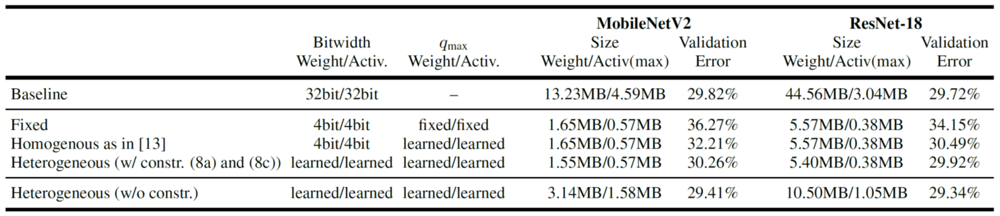

# MIXED PRECISION DNNs

This is the code for Mixed Precision DNNs: All you need is a good parametrization, ICLR 2020.

> [**Mixed Precision DNNs: All you need is a good parametrization**](https://openreview.net/forum?id=Hyx0slrFvH&noteId=Hyx0slrFvH&invitationId=ICLR.cc/2020/Conference/Paper2519),            
> Uhlich, Stefan and Mauch, Lukas and Cardinaux, Fabien and Yoshiyama, Kazuki and Garcia, Javier Alonso and Tiedemann, Stephen and Kemp, Thomas and Nakamura, Akira. 
> ICLR 2020 
> *arXiv technical report ([arXiv 1905.11452]( https://arxiv.org/abs/1905.11452))*


## Abstract 
Efficient deep neural network (DNN) inference on mobile or embedded devices typically involves quantization of the network parameters and activations. In particular, mixed precision networks achieve better performance than networks with homogeneous bitwidth for the same size constraint. Since choosing the optimal bitwidths is not straight forward, training methods, which can learn them, are desirable. Differentiable quantization with straight-through gradients allows to learn the quantizer's parameters using gradient methods. We show that a suited parametrization of the quantizer is the key to achieve a stable training and a good final performance. Specifically, we propose to parametrize the quantizer with the step size and dynamic range. The bitwidth can then be inferred from them. Other parametrizations, which explicitly use the bitwidth, consistently perform worse. We confirm our findings with experiments on CIFAR-10 and ImageNet and we obtain mixed precision DNNs with learned quantization parameters, achieving state-of-the-art performance. 

## Mixed Precision ResNet-18 / MobileNetV2 on ImageNet 




## Dependencies 
- Python3
- [nnabla](https://github.com/sony/nnabla) 1.7.0
- attrs


## Installation

Please follow nnabla installation guide on https://nnabla.org/download/

## Running mixed precision training 

This repository provides the code to train ResNet [[1]](#1)  and MobileNetV2 [2]](#2) with mixed precision. 

The training setup can be adjusted in the config files (.cfg). The setup used in the paper results are included in the provided configuration files. 

For uniform and power-of-two
quantization, there are three different parametrizations possible.
Depending on what we want to learn, the following parametrization
should be used:

* Fixed bitwidth: Use `b_xmax`
* Learnable bitwidth: Use `delta_xmax` (uniform) and `xmin_xmax`
  (power-of-two)

Example: In order to learn a network where we only optimize
for the dynamic range (`xmax`) you can use the following command

```
python train_resnet.py PARAMETRIC_FP_W2Q_B_XMAX_CON_INIT --cfg train_resnet_quant_fp.cfg
```

## Citation

```
@inproceedings{uhlich2019mixed,
  title={Mixed Precision DNNs: All you need is a good parametrization},
  author={Uhlich, Stefan and Mauch, Lukas and Cardinaux, Fabien and Yoshiyama, Kazuki and Garcia, Javier Alonso and Tiedemann, Stephen and Kemp, Thomas and Nakamura, Akira},
  booktitle={International Conference on Learning Representations},
  year={2019}
}
```

## References
<a id="1">[1]</a> 
He, Kaiming, et al. "Deep residual learning for image recognition." Proceedings of the IEEE conference on computer vision and pattern recognition. 2016.

<a id="2">[2]</a> 
Sandler, Mark, et al. "Mobilenetv2: Inverted residuals and linear bottlenecks." Proceedings of the IEEE conference on computer vision and pattern recognition. 2018.


