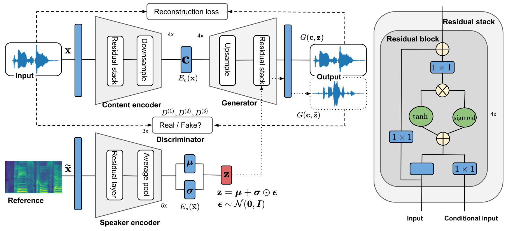

# NVC-Net: End-to-End Adversarial Voice Conversion

This repository contains the official NNabla implementation of [NVC-Net: End-to-End Adversarial Voice Conversion](https://arxiv.org/pdf/2106.00992.pdf).

**Abstract:** <div style="text-align: justify"> Voice conversion has gained increasing popularity in many applications of speech synthesis. The idea is to change the voice identity from one speaker into another while keeping the linguistic content unchanged. Many voice conversion approaches rely on the use of a vocoder to reconstruct the speech from acoustic features, and as a consequence, the speech quality heavily depends on such a vocoder. In this paper, we propose NVC-Net, an end-to-end adversarial network, which performs voice conversion directly on the raw audio waveform of arbitrary length. By disentangling the speaker identity from the speech content, NVC-Net is able to perform not only non-parallel traditional many-to-many voice conversion, but also zero-shot voice conversion from a short utterance of an unseen target speaker. More importantly, NVC-Net is non-autoregressive and fully convolutional, achieving fast inference. Our model is capable of producing samples at a rate of more than 3600 kHz on an NVIDIA V100 GPU, being orders of magnitude faster than state-of-the art methods under the same hardware configurations. Objective and subjective evaluations on non-parallel many-to-many voice conversion tasks show that NVC-Net obtains competitive results with significantly fewer parameters. </div>





**Hyperparameters:** All hyper-parameters are defined in [hparams.py](./hparams.py).

**Audio samples:** Some audio samples can be found at the demo website http://nvcnet.github.io/

## Requirements
Install `python >= 3.6`, then set up python dependencies from [requirements.txt](./requirements.txt):

```bash
pip install -r ./requirements.txt
```
Note that this `requirements.txt` doesn't contain `nnabla-ext-cuda`.
If you have CUDA environment, we highly recommend to install `nnabla-ext-cuda` and use GPU devices. See [NNabla CUDA extension package installation guide](https://nnabla.readthedocs.io/en/latest/python/pip_installation_cuda.html).


Alternatively, one can build the docker image
```bash
bash scripts/docker_build.sh
```

## Data set
We use the [VCTK data set](https://datashare.ed.ac.uk/handle/10283/3443). Download the dataset, then run the following command to prepare trianing and validation sets.
```bash
python preprocess.py -i <path to `VCTK-Corpus/wav48/`> \
       -o <path to save precomputed inputs> \
       -s data/list_of_speakers.txt \
       --make-test
```
- List of speakers used for training the model can be found [here](data/list_of_speakers.txt).
- List of speakers used for the traditional subjective evaluation can be found [here](data/list_of_subs.txt).
- List of speakers used for the zero-shot evaluation can be found [here](data/list_of_unseen_speakers.txt).
- Gender information about speakers can be found [here](data/speaker-info.txt).

## Training
All hyper-parameters used for training are defined at [hparams.py](hparams.py). These parameters can also be changed in the command line.
```bash
mpirun -n <number of GPUs> python main.py -c cudnn -d <list of GPUs e.g., 0,1,2,3> \
       --output_path log/baseline/ \
       --batch_size 8 \
       ...
```

## Inference
The conversion can be performed as follows.
```bash
python inference.py -c cudnn -d <list of GPUs e.g., 0,1> \
       -m <path to pretrained model> \
       -i <input audio file> \
       -r <reference audio file> \
       -o <output audio file>
```

## Citation

```
@article{nguyen2021nvc,
  title={NVC-Net: End-to-End Adversarial Voice Conversion},
  author={Nguyen, Bac and Cardinaux, Fabien},
  journal={arXiv preprint arXiv:2106.00992},
  year={2021}
}
```