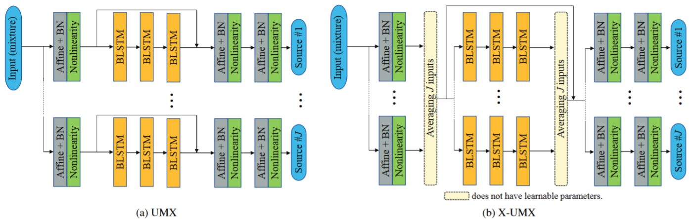

#  CrossNet-Open-Unmix (X-UMX)

This repository contains the NNabla implementation of __CrossNet-Open-Unmix (X-UMX)__, an improved version of [Open-Unmix (UMX)](umx.md) for music source separation. X-UMX achieves an improved performance without additional learnable parameters compared to the original UMX model. Details of X-UMX can be found in [our paper](https://arxiv.org/abs/2010.04228).

## Quick Music Source Separation Demo by X-UMX

From the Colab link below, you can try using X-UMX to generate and listen to separated audio sources of your audio music file. Please give it a try!

[](https://colab.research.google.com/github/sony/ai-research-code/blob/master/x-umx/X-UMX.ipynb)

__Related Projects:__  x-umx | [open-unmix-nnabla](umx.md) | [open-unmix-pytorch](https://github.com/sigsep/open-unmix-pytorch) | [musdb](https://github.com/sigsep/sigsep-mus-db) | [museval](https://github.com/sigsep/sigsep-mus-eval) | [norbert](https://github.com/sigsep/norbert) | [sigsep-mus-io](https://github.com/sigsep/sigsep-mus-io)

## The Model



As shown in Figure (b), __X-UMX__ has almost the same architecture as the original UMX, 
but only differs by two additional average operations that link the instrument models together. 
Since these operations are not DNN layers, the number of learnable parameters of __X-UMX__ is 
the same as for the original UMX and also the computational complexity is almost the same. 
Besides the model, there are two more differences compared to the original UMX. In particular, 
Multi Domain Loss (MDL) and a Combination Loss (CL) are used during training, which are different 
from the original loss function of UMX. Hence, these three contributions, i.e., (i) Crossing architecture, 
(ii) MDL and (iii) CL, make the original UMX more effective and successful without additional learnable parameters.

## Getting started

## Prerequisites
* nnabla >= v1.19.0
* musdb
* norbert
* resampy
* ffmpeg

### Installation

For installation we recommend to use the [Anaconda](https://anaconda.org/) python distribution. To create a conda environment for _open-unmix_, simply run:

`conda env create -f environment-X.yml` where `X` is either [`cpu`, `gpu`], depending on your system. 

## Source separation with pretrained model

### How to separate using pre-trained X-UMX
Download [here](https://nnabla.org/pretrained-models/ai-research-code/x-umx/x-umx.h5) a pre-trained model of X-UMX which results in the scores given in [our paper](https://arxiv.org/pdf/2010.04228.pdf).
The model was trained on the [MUSDB18](https://sigsep.github.io/datasets/musdb.html) dataset.

In order to use it, please use the following command:
```bash
python test.py  --inputs [Input mixture (any audio format supported by FFMPEG)] --model {path to downloaded x-umx.h5 weights file} --context cudnn --chunk-dur 10 --out-dir ./results/ 
```

Please note that our X-UMX integrates the different instrument networks of the original UMX by a crossing operation, and thus X-UMX requires more memory. So, it maybe difficult to run the model on smaller GPU. So, we suggest users to set `--chunk-dur` with values appropriate for each computer. It is used to break audio into smaller chunks, separate sources and stitch them back together. Thus it reduces the required GPU memory. If your inference still crashes, kindly reduce chunk duration and try again.

## Evaluation using `museval`

To perform evaluation in comparison to other SiSEC systems, you would need to install the `museval` package using

```
pip install museval
```

and then run the evaluation using

```bash
python eval.py --model [path to downloaded model file (./x-umx.h5)] --root [Path to MUSDB18 dataset] --out-dir [Path to save musdb estimates and museval results]
```

## Training X-UMX
X-UMX can be trained using the default parameters of the train.py function.

The [MUSDB18](https://sigsep.github.io/datasets/musdb.html) is one of the largest freely available datasets for professionally produced music tracks (~10h duration) of different styles. It comes with isolated `drums`, `bass`, `vocals` and `others` stems. _MUSDB18_ contains two subsets: "train", composed of 100 songs, and "test", composed of 50 songs.

To directly train _x-umx_, we first would need to download the dataset and place in _unzipped_ in a directory of your choice (called `root`).

| Argument | Description | Default |
|----------|-------------|---------|
| `--root <str>` | path to root of dataset on disk. | `None` |

Also note that, if `--root` is not specified, we automatically download a 7 second preview version of the MUSDB18 dataset. While this is comfortable for testing purposes, we wouldn't recommend to actually train your model on this.

#### Using WAV files

All files from the MUSDB18 dataset are encoded in the Native Instruments stems format (.mp4). If you want to use WAV files (e.g. for faster audio decoding), `musdb` also supports parsing and processing pre-decoded PCM/wav files. Downloaded STEMS dataset (.mp4) can be decoded into WAV version either by [docker based solution or running scripts manually as shown here](https://github.com/sigsep/sigsep-mus-io).

__When you use the decoded MUSDB18 dataset (WAV version), use the `--is-wav` argument while running train.py.__

### Single GPU training

#### For encoded MUSDB18 STEMS version
```bash
python train.py --root [Path of MUSDB18] --output [Path to save weights]
```

#### For decoded MUSDB18 WAV version
```bash
python train.py --root [Path of MUSDB18] --output [Path to save weights] --is-wav
```

### Distributed Training
For distributed training [install NNabla package compatible with Multi-GPU execution](https://nnabla.readthedocs.io/en/latest/python/pip_installation_cuda.html#pip-installation-distributed). Use the below code to start the distributed training.
```
export CUDA_VISIBLE_DEVICES=0,1,2,3 {device ids that you want to use}
```

#### For encoded MUSDB18 STEMS version
```bash
mpirun -n {no. of devices} python train.py --root [Path of MUSDB18] --output [Path to save weights]
```

#### For decoded MUSDB18 WAV version
```bash
mpirun -n {no. of devices} python train.py --root [Path of MUSDB18] --output [Path to save weights] --is-wav
```

Please note that above sample training scripts will work on high quality 'STEM' or low quality 'MP4 files'. In case you would like faster data loading, kindly look at [more details here](https://github.com/sigsep/sigsep-mus-db#using-wav-files-optional) to generate decoded 'WAV' files. In that case, please use `--is-wav` flag for training.

Training `MUSDB18` using _x-umx_ comes with several design decisions that we made as part of our defaults to improve efficiency and performance:

* __chunking__: we do not feed full audio tracks into _x-umx_ but instead chunk the audio into 6s excerpts (`--seq-dur 6.0`).
* __balanced track sampling__: to not create a bias for longer audio tracks we randomly yield one track from MUSDB18 and select a random chunk subsequently. In one epoch we select (on average) 64 samples from each track.
* __source augmentation__: we apply random gains between `0.25` and `1.25` to all sources before mixing. Furthermore, we randomly swap the channels the input mixture.
* __random track mixing__: for a given target we select a _random track_ with replacement. To yield a mixture we draw the interfering sources from different tracks (again with replacement) to increase generalization of the model.
* __fixed validation split__: we provide a fixed validation split of [14 tracks](https://github.com/sigsep/sigsep-mus-db/blob/b283da5b8f24e84172a60a06bb8f3dacd57aa6cd/musdb/configs/mus.yaml#L41). We evaluate on these tracks in full length instead of using chunking to have evaluation as close as possible to the actual test data.

Some of the parameters for the MUSDB sampling can be controlled using the following arguments:

| Argument      | Description                                                            | Default      |
|---------------------|-----------------------------------------------|--------------|
| `--is-wav`          | loads the decoded WAVs instead of STEMS for faster data loading. See [more details here](https://github.com/sigsep/sigsep-mus-db#using-wav-files-optional). | `False`      |
| `--samples-per-track <int>` | sets the number of samples that are randomly drawn from each track  | `64`       |
| `--source-augmentations <list[str]>` | applies augmentations to each audio source before mixing | `gain, channelswap`       |

## Training and Model Parameters

An extensive list of additional training parameters allows researchers to quickly try out different parameterizations such as a different FFT size. The table below, we list the additional training parameters and their default values:

| Argument      | Description                                                                     | Default         |
|----------------------------|---------------------------------------------------------------------------------|-----------------|
| `--output <str>`           | path where to save the trained output model as well as checkpoints.                         | `./x-umx`      |
| `--epochs <int>`           | Number of epochs to train                                                       | `1000`          |
| `--batch-size <int>`       | Batch size has influence on memory usage and performance of the LSTM layer      | `16`            |
| `--seq-dur <int>`          | Sequence duration in seconds of chunks taken from the dataset. A value of `<=0.0` results in full/variable length               | `6.0`           |
| `--hidden-size <int>`             | Hidden size parameter of dense bottleneck layers  | `512`            |
| `--nfft <int>`             | STFT FFT window length in samples                                               | `4096`          |
| `--nhop <int>`             | STFT hop length in samples                                                      | `1024`          |
| `--lr <float>`             | learning rate                                                                   | `0.001`        |
| `--lr-decay-patience <int>`             | learning rate decay patience for plateau scheduler                                                                   | `80`        |
| `--lr-decay-gamma <float>`             | gamma of learning rate plateau scheduler.  | `0.3`        |
| `--weight-decay <float>`             | weight decay for regularization                                                                   | `0.00001`        |
| `--bandwidth <int>`        | maximum bandwidth in Hertz processed by the LSTM. Input and Output is always full bandwidth! | `16000`         |
| `--nb-channels <int>`      | set number of channels for model (1 for mono (spectral downmix is applied,) 2 for stereo)                     | `2`             |
| `--context <str>`          | Extension modules. ex) 'cpu', 'cudnn'.                                   | 'cudnn'         |
| `--seed <int>`             | Initial seed to set the random initialization                                   | `42`            |
| `--valid_dur <float>`       | To prevent GPU memory overflow, validation is calculated and averaged per `valid_dur` seconds.       | `100.0`       |


### Authors
Ryosuke Sawata(\*), Stefan Uhlich(\*\*), Shusuke Takahashi(\*) and Yuki Mitsufuji(\*)

(\*)  Sony Corporation, Tokyo, Japan  
(\*\*)Sony Europe B.V., Stuttgart, Germany


## References

<details><summary>If you use CrossNet-open-unmix for your research – Cite CrossNet-Open-Unmix</summary>

```latex
@article{sawata20,  
  title={All for One and One for All: Improving Music Separation by Bridging Networks},
  author={Ryosuke Sawata and Stefan Uhlich and Shusuke Takahashi and Yuki Mitsufuji},
  year={2020},
  eprint={2010.04228},
  archivePrefix={arXiv},
  primaryClass={eess.AS}
}
```

</p>
</details>

<details><summary>If you use open-unmix for your research – Cite Open-Unmix</summary>

```latex
@article{stoter19,  
  author={F.-R. St\\"oter and S. Uhlich and A. Liutkus and Y. Mitsufuji},  
  title={Open-Unmix - A Reference Implementation for Music Source Separation},  
  journal={Journal of Open Source Software},  
  year=2019,
  doi = {10.21105/joss.01667},
  url = {https://doi.org/10.21105/joss.01667}
}
```

</p>
</details>

<details><summary>If you use the MUSDB dataset for your research - Cite the MUSDB18 Dataset</summary>
<p>

```latex
@misc{MUSDB18,
  author       = {Rafii, Zafar and
                  Liutkus, Antoine and
                  Fabian-Robert St{\"o}ter and
                  Mimilakis, Stylianos Ioannis and
                  Bittner, Rachel},
  title        = {The {MUSDB18} corpus for music separation},
  month        = dec,
  year         = 2017,
  doi          = {10.5281/zenodo.1117372},
  url          = {https://doi.org/10.5281/zenodo.1117372}
}
```

</p>
</details>


<details><summary>If you compare your results with SiSEC 2018 Participants - Cite the SiSEC 2018 LVA/ICA Paper</summary>
<p>

```latex
@inproceedings{SiSEC18,
  author="St{\"o}ter, Fabian-Robert and Liutkus, Antoine and Ito, Nobutaka",
  title="The 2018 Signal Separation Evaluation Campaign",
  booktitle="Latent Variable Analysis and Signal Separation:
  14th International Conference, LVA/ICA 2018, Surrey, UK",
  year="2018",
  pages="293--305"
}
```

</p>
</details>

⚠️ Please note that the official acronym for _CrossNet-Open-Unmix_ is **X-UMX**.
